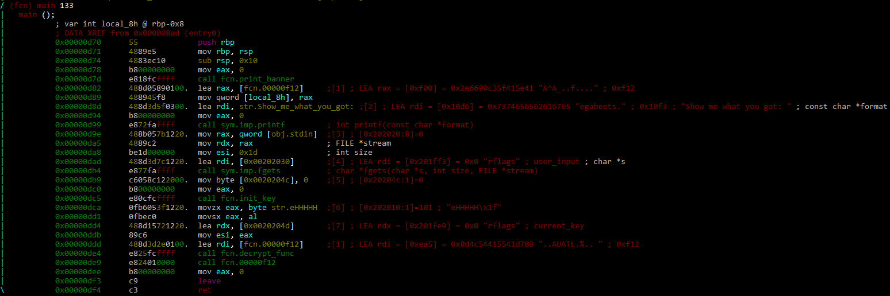
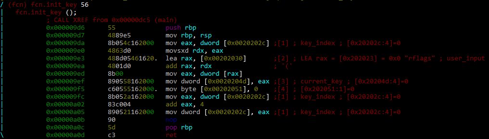
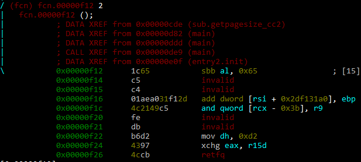
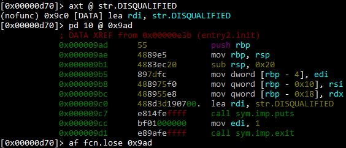
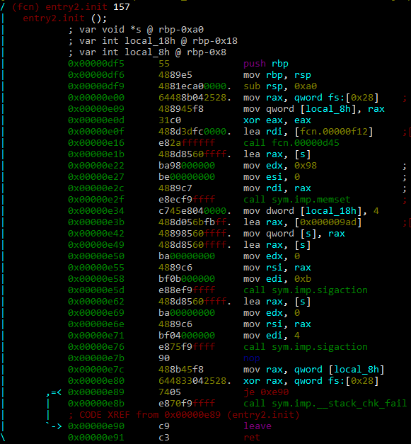
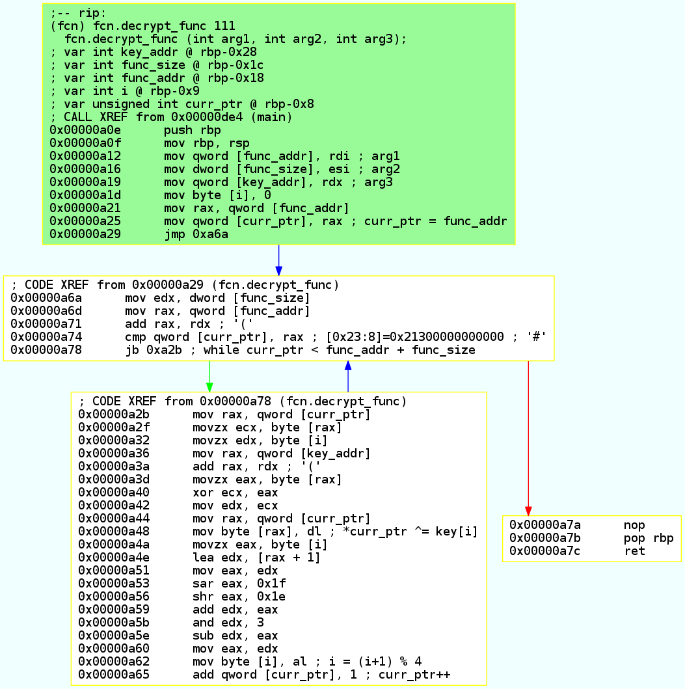
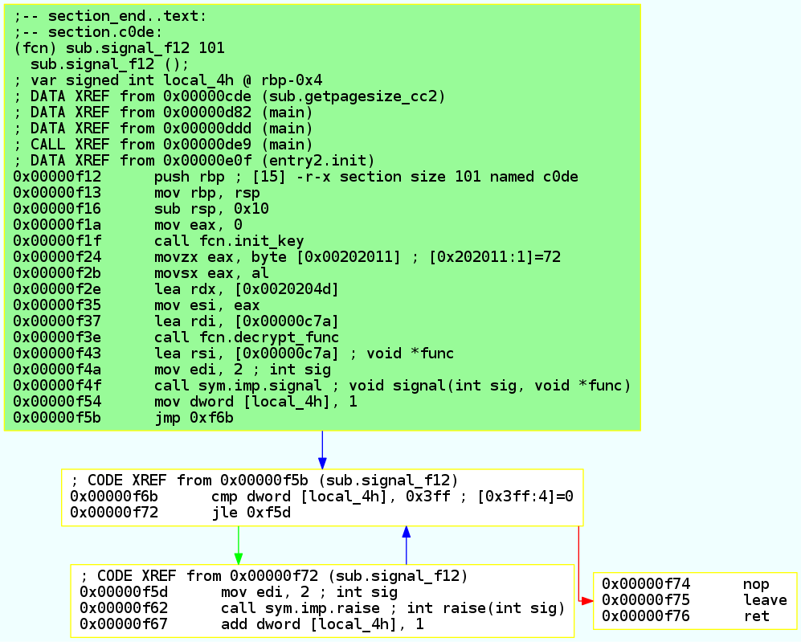

# Disqualified write-up

## First observations

The challenge file is a 64 bit ELF executable, dynamically linked and stripped.

```
$ file disqualified_6144fa7e73cf0337215b60737fb2384b.bin
disqualified_6144fa7e73cf0337215b60737fb2384b.bin: ELF 64-bit LSB shared object, x86-64, version 1 (SYSV), dynamically linked, interpreter /lib64/ld-linux-x86-64.so.2, for GNU/Linux 3.2.0, BuildID[sha1]=8036436bc4ddc71d381c4c993031300682be9b39, stripped
```

Running it displays the following :

```
$ ./disqualified_6144fa7e73cf0337215b60737fb2384b.bin
_____  ___   _____ ____  _   _ ___   ___  __  ___
|  __ \|__ \ / ____/ __ \| \ | |__ \ / _ \/_ |/ _ \
| |__) |  ) | |   | |  | |  \| |  ) | | | || | (_) |
|  _  /  / /| |   | |  | | . ` | / /| | | || |> _ <
| | \ \ / /_| |___| |__| | |\  |/ /_| |_| || | (_) |
|_|  \_\____|\_____\____/|_| \_|____|\___/ |_|\___/

by Megabeets

Show me what you got: akfalkfanlkfnla
DISQUALIFIED!
```

We open the file in *radare2* and start the analysis.

## Main functions
The `main` function is quite short :

  

The function starts by printing the banner and the `Show me what you got: ` message, and the reads 28 (0x1D - 1) characters from the standard input using `fgets`.

The `fcn.init_key (0x000009d6)` function takes the first 4 bytes of the user input, stores them at `0x0020204d`, and adds 4 to the `dword` at `0x0020202c`. This value represents the index of the next 4-bytes that will be used as a key in the user-input string.



The `main` function then calls the `decrypt_func` function, passing the following arguments :
* The address of a function to decrypt (`fcn.00000f12`)
* The size of the function (`101` bytes)
* The address of the decryption key (`0x0020204d`)

The `fcn.00000f12` function is called after this decryption, and is initially made of invalid instructions before decryption.



## Checking the user input
At this point, we do not known how the user input's validity is checked. We look for XREFS for the string `"DISQUALIFIED!"`, and find a function at `0x9ad` not recognized by *radare2*'s initial analysis :



The function is itself referenced in `entry2.init`. The latter makes the `.c0de` section (starting at `0xf12` and containing the `fcn.00000f12` function) writable, and registers `fcn.lose` as a signal handler for the signals `SIGILL (4)` and `SIGEGV (0xb)`.



So if the `fcn.00000f12` function is not correctly decrypted, it will be likely that its execution will cause an exception (*illegal instruction/SIGILL* or *segmentation fault/SIGEGV*), and trigger the `fcn.lose` function.  


## Decryption algorithm
After analyze, the code of `fcn.decrypt_func` is the following (graph exported using `[r2]> agfd @ fcn.decrypt_func > decrypt_func.dot` and `sh$ dot -Tpng decrypt_func.dot > decrypt_func.png`) :



The graph is equivalent to the following C code:
```C
void decrypt_func(char *func_addr, int func_size, char *key){
    int i = 0;
    for (char *curr_ptr; curr_ptr < func_addr + func_size; curr_ptr++){
        *curr_ptr ^= key[i];
        i = (i + 1) % 4;
    }
}
```

## Solving the challenge
In order to find the decryption key, we suppose that the function's first instructions are `push rbp; move rbp, rsp`, which correspond to the bytes `0x55 0x48 0x89` and `0xe5`. The decryption key can thus be computed by XOR'ing these bytes with the first 4 bytes of the encrypted function `fcn.00000f12`.

Using the follwing code based on `r2pipe`, we decrypt the function at `0xf12` :

```python
#!/usr/bin/python2
import r2pipe
import shutil
import json

def repeating_xor(text, key):
    key = key * len(text)
    key = key[:len(text)]
    return [a ^ b for (a,b) in zip(text, key)]

def decrypt_func(r, addr, size):
    r.cmd("s %d" % addr)
    func_content = json.loads(r.cmd("pxj %d" % size))
    key = [a ^ b for (a,b) in zip(func_content[:4], [0x55,0x48,0x89,0xe5])]

    print "[+] Key : %s" % "".join(map(chr, key))
    decoded_xor = repeating_xor(func_content, key)

    decoded_xor = "".join(map(chr, decoded_xor)).encode("hex")
    r.cmd("wx %s" % decoded_xor)
    return "".join(map(chr, key))

shutil.copyfile("./disqualified_6144fa7e73cf0337215b60737fb2384b.bin", "./disqualified_6144fa7e73cf0337215b60737fb2384b_decrypted.bin")
r = r2pipe.open("./disqualified_6144fa7e73cf0337215b60737fb2384b_decrypted.bin", flags=["-w"])

decrypt_func(r, 0xf12, 101)
```

We then open the decrypted file, and take a look at the function at `0xf12` :



Similarly, the function at `0xc7a` is decrypted with the next 4 bytes of the user input, and is indirectly called using a signal. This same pattern is repeated 6 times, we progressively decrypt the binary by re-running our decryption script each time, and manually retrieving the address and size of the next function.

The final script used to recover the full user input is the following

```python
[...]
r = r2pipe.open("./disqualified_6144fa7e73cf0337215b60737fb2384b_decrypted.bin", flags=["-w"])


key = ""
key += decrypt_func(r, 0xf12, 101)
key += decrypt_func(r, 0xc7a, 72)
key += decrypt_func(r, 0xc32, 72)
key += decrypt_func(r, 0xbea, 72)
key += decrypt_func(r, 0xba2, 72)
key += decrypt_func(r, 0xb5a, 72)
key += decrypt_func(r, 0xb3b, 0x1F)

print "Key is : %s " % repr(key)
r.quit()
```

```
$ python solve.py
[+] Key : I-L!
[+] Key : k3=w
[+] Key : hat_
[+] Key : y0U-
[+] Key : Got!
[+] Key : G00D
[+] Key : _JOB
Key is : 'I-L!k3=what_y0U-Got!G00D_JOB'
```
